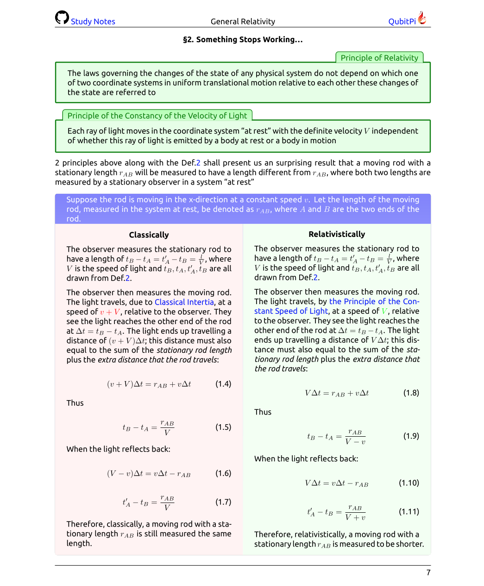

Study Notes on General Relativity
=================================

[![LaTeX Badge][LaTeX Badge]][LaTeX URL]
[![Ubuntu Font Badge][Ubuntu Font Badge]][Ubuntu Font URL]
[![Apache License Badge]][Apache License URL]

<div align="center">
    
    <a href="http://relativity.qubitpi.org/study-notes.pdf">
        
    </a>
    
</div>

Physics is, as I view it, a quantified version of Philosophy on how world actually works. Astrophysics is my favorite
branch of Physics because

1. it stands as an opposing side of my familiar Quantum Mechanics and trains me the skill of thinking about lots of
   problems from different perspectives, and
2. __those who masters General Relativity or Physics in general has their best advantage to learn and analyze Business
   or Technical problems in a systematic, logical, and correct way__

I, hereby, present my ongoing effort of
[__Study Notes on General Theory of Relativity__][Study Notes on General Relativity], the "Math" behind our universe

<div align="center">
    <a href="https://youtu.be/Z6Jt4lCe8_I?si=n6opy2Ljv6Uqf80A"></a>
</div>

Documentation on How to Compile The Notes
-----------------------------------------

### Setup

1. Install [Tex Live][LaTeX URL] (version ≥ 2021)
2. Download and install [Ubuntu Font][Ubuntu Font URL]. For how to install a new System font:

   - Linux users shall consult [this thread](https://askubuntu.com/a/191782)
   - Mac users can follow [this Apple support](https://support.apple.com/guide/font-book/install-and-validate-fonts-fntbk1000/mac)

3. Make sure [GNU Make] is installed with

   ```console
   make --version
   ```
   
   which, when installed, outputs something like this

   ```console
   GNU Make 3.81
   Copyright (C) 2006  Free Software Foundation, Inc.
   This is free software; see the source for copying conditions.
   There is NO warranty; not even for MERCHANTABILITY or FITNESS FOR A
   PARTICULAR PURPOSE.

   This program built for i386-apple-darwin11.3.0
   ```
   
   `make` should be installed in almost every Linux distribution and Mac user can install via `brew install make`

### Getting Source Code

```console
git clone https://github.com/QubitPi/general-relativity.git
cd general-relativity
```

### Compiling Notes

```console
make
```

You now have my love of Physics located at [`./study-notes.pdf`][Study Notes on General Relativity]

License
-------

The use and distribution terms for this book are covered by the [Apache License, Version 2.0].

<div align="center">
    <a href="https://opensource.org/licenses">
        
    </a>
</div>

[Study Notes on General Relativity]: http://relativity.qubitpi.org/study-notes.pdf

[Apache License Badge]: https://img.shields.io/badge/Apache%202.0-F25910.svg?style=for-the-badge&logo=Apache&logoColor=white
[Apache License URL]: https://www.apache.org/licenses/LICENSE-2.0
[Apache License, Version 2.0]: http://www.apache.org/licenses/LICENSE-2.0.html

[GNU Make]: https://trello.com/c/xv3Hso1O

[LaTeX Badge]: https://img.shields.io/badge/LaTeX-TeX%20Live%E2%89%A52021-008080.svg?style=for-the-badge&logo=latex&logoColor=white
[LaTeX URL]: https://tug.org/texlive/

[Ubuntu Font Badge]: https://img.shields.io/badge/Ubuntu%20Font-E95420.svg?style=for-the-badge&logo=ubuntu&logoColor=white
[Ubuntu Font URL]: https://design.ubuntu.com/font
