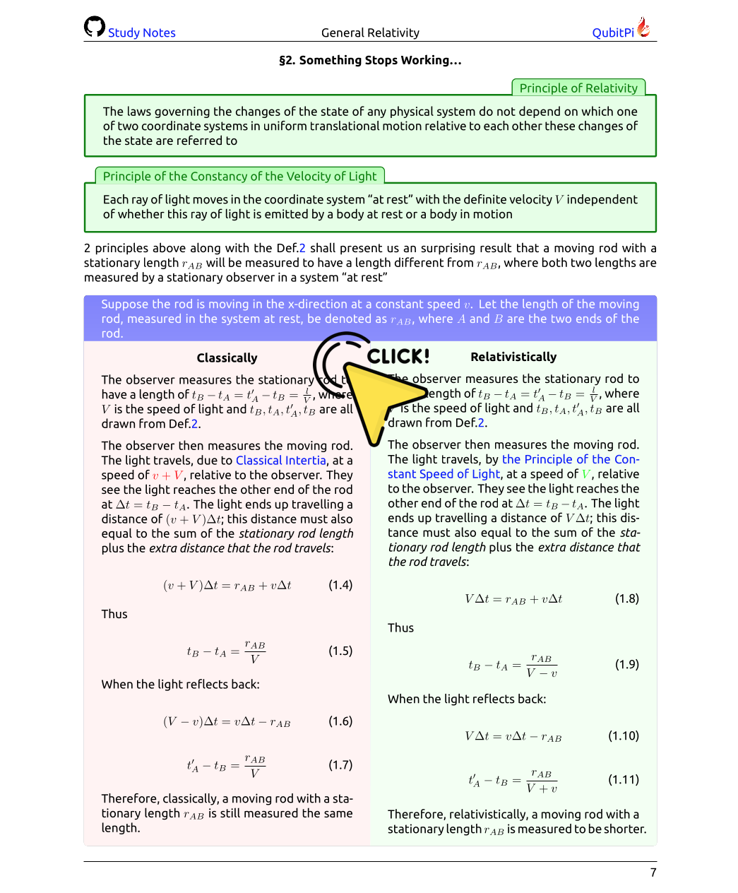

Study Notes on General Relativity
=================================

[![LaTeX Badge][LaTeX Badge]][LaTeX URL]
[![Ubuntu Font Badge][Ubuntu Font Badge]][Ubuntu Font URL]
[![Apache License Badge]][Apache License URL]

<div align="center">
    
    <a href="http://relativity.qubitpi.org/study-notes.pdf">
        
    </a>
    
</div>

Physics is, as I view it, a quantified version of Philosophy on how world actually works. It's pushing the limits of
human knowledge to futuristic inquiries such as

- Will [Dark Matter/Dark Energy](https://youtu.be/6EavTTbuIq4?si=fAc1V1OW9LKJBCvk) bring the possibility of next-human
  generation technologies?
- Does gigantic celestial object, such as Black Hole, permit spacetime travelling into the future for humanities?
- Is there [another universe/world](https://youtu.be/GQTq1kufCLk?si=oOykmrp9u6xt-iJ0) that obeys a different philosophical system?

Astrophysics, thus, is my favorite branch of Physics and __those who masters General Relativity or Physics in general
has their best advantage to learn and analyze Business or Technical problems in a systematic, logical, and correct way__
as well

I, hereby, present my ongoing effort of
[__Study Notes on General Theory of Relativity__][Study Notes on General Relativity], the "Math" behind our universe

<div align="center">
    <a href="https://youtu.be/Z6Jt4lCe8_I?si=n6opy2Ljv6Uqf80A"></a>
</div>

---

<!-- TOC -->
* [Study Notes on General Relativity](#study-notes-on-general-relativity)
  * [What I Learn About Learning General Relativity](#what-i-learn-about-learning-general-relativity)
  * [How to Compile Study Notes](#how-to-compile-study-notes)
    * [Setup](#setup)
    * [Getting Study Notes Source Code](#getting-study-notes-source-code)
    * [Compiling Notes](#compiling-notes)
  * [Resources on General Relativity](#resources-on-general-relativity)
    * [Black Holes](#black-holes)
    * [Gravitational Wave](#gravitational-wave)
    * [Python Libraries](#python-libraries)
  * [License](#license)
<!-- TOC -->

What I Learn About Learning General Relativity
----------------------------------------------

- Nothing comes up in its final form on its first rendering. 

How to Compile Study Notes
--------------------------

### Setup

1. Install [Tex Live][LaTeX URL] (version ≥ 2021)
2. Download and install [Ubuntu Font][Ubuntu Font URL]. For instructions on how to install a new System font please
   refer to the following links:

   - Linux users shall consult [this thread](https://askubuntu.com/a/191782)
   - Mac users can follow [this Apple support](https://support.apple.com/guide/font-book/install-and-validate-fonts-fntbk1000/mac)

3. Make sure [GNU Make] is installed with

   ```console
   make --version
   ```
   
   which, when installed, outputs something like this

   ```console
   GNU Make 3.81
   Copyright (C) 2006  Free Software Foundation, Inc.
   This is free software; see the source for copying conditions.
   There is NO warranty; not even for MERCHANTABILITY or FITNESS FOR A
   PARTICULAR PURPOSE.

   This program built for i386-apple-darwin11.3.0
   ```
   
   `make` should be installed in almost every Linux distribution and Mac user can install via `brew install make`

### Getting Study Notes Source Code

```console
git clone https://github.com/QubitPi/general-relativity.git
cd general-relativity
```

### Compiling Notes

> [!NOTE]
> Please be patient as the compilation takes some time 

```console
make
```

You now have my love of Physics located at [`./study-notes.pdf`][Study Notes on General Relativity]

Resources on General Relativity
-------------------------------

[](https://youtube.com/playlist?list=PL-CLnI8tPXu8bfJ5oVbVZdu16_xyg0Bkf&si=txt5-pf9fqk06ppp)

### Black Holes

- [black-holes.org](https://www.black-holes.org/)
- [LIGO](https://www.ligo.caltech.edu/)

### Gravitational Wave

1. [How are gravitational waves created and measured?](https://youtu.be/ytV1KhjEQbs?si=goI3LG8Ohn0HPn1q)
2. [How can a gravitational-wave signal be used to measure the mass and distance of its source?](https://youtu.be/CySut_9aKc0?si=sDRkP365nliufWtO)
3. [Gravitational Wave Fitter mentioned in the 2 videos above](https://qubitpi.github.io/gravitational-wave-fitter/) ([Source Code](https://github.com/QubitPi/gravitational-wave-fitter))
4. [Gravitational Wave Quickview App](https://gravitational-wave-quickview.streamlit.app/)
5. [Discover, read, and plot gravitational wave data](https://nbviewer.org/github/QubitPi/jupyter-notebooks/blob/master/notebooks/gravitational-wave/Quickview.ipynb)

### Python Libraries

- [Astropy](https://www.astropy.org/)
- [GwPy](https://gwpy.github.io/docs/stable/)
- [PyCBC](https://pycbc.org/)

License
-------

The use and distribution terms for this book are covered by the [Apache License, Version 2.0].

<div align="center">
    <a href="https://opensource.org/licenses">
        
    </a>
</div>

[Study Notes on General Relativity]: http://relativity.qubitpi.org/study-notes.pdf

[Apache License Badge]: https://img.shields.io/badge/Apache%202.0-F25910.svg?style=for-the-badge&logo=Apache&logoColor=white
[Apache License URL]: https://www.apache.org/licenses/LICENSE-2.0
[Apache License, Version 2.0]: http://www.apache.org/licenses/LICENSE-2.0.html

[GNU Make]: https://trello.com/c/xv3Hso1O

[LaTeX Badge]: https://img.shields.io/badge/LaTeX-TeX%20Live%E2%89%A52021-008080.svg?style=for-the-badge&logo=latex&logoColor=white
[LaTeX URL]: https://tug.org/texlive/

[Ubuntu Font Badge]: https://img.shields.io/badge/Ubuntu%20Font-E95420.svg?style=for-the-badge&logo=ubuntu&logoColor=white
[Ubuntu Font URL]: https://design.ubuntu.com/font
