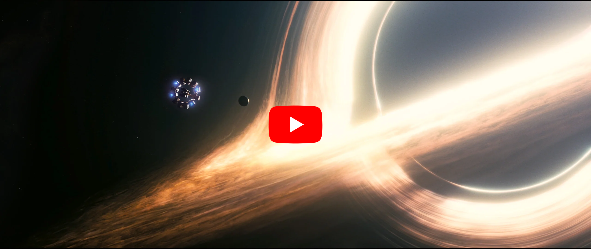

Study Notes on General Relativity
=================================

[![LaTeX Badge][LaTeX Badge]][LaTeX URL]
[![Ubuntu Font Badge][Ubuntu Font Badge]][Ubuntu Font URL]
[![Apache License Badge]][Apache License, Version 2.0]

<div align="center">
    
    <a href="http://relativity.qubitpi.org/study-notes.pdf">
        
    </a>
    
</div>

The mysterious connection between Quantum and Astrophysics through black hole's Singularity keeps my curiosity high
every day, which is why I spend time on studying __General Relativity__. Not only that, those who master General
Relativity or Physics in general has their best advantage to learn and analyze Business or Technical problems in a
systematic, logical, and correct way as well. I, hereby, present my ongoing effort of
[Study Notes on General Theory of Relativity][Study Notes on General Relativity], the Math behind our universe

<div align="center">
    <a href="https://youtu.be/Z6Jt4lCe8_I?si=n6opy2Ljv6Uqf80A"></a>
</div>

What I Stumbled Upon on the Study of General Relativity
-------------------------------------------------------

- Nothing comes up in its final form on its first rendering. There must be iterations of corrections and 
  improvements before we are able to show the world something really fascinating. For example, I made several 
  conceptual mistakes on Einstein's Special Relativity paper on its first read and was forced to come back to it 
  several  times before I came very close to what Einstein was really talking about. I believe Tesla, Apple, Google, or
  many great organizations never shows up from nothing. Their founders must have gone through phases of growth and
  practice before reaching that peak!
- The most perfect theory (Electromagnetism) didn't start with the most logical philosophical inquiry but through
  earth-touching experiments (Faraday on _Experimental researches in electricity_)

How to Compile Study Notes
--------------------------

### Setup

1. Install [Tex Live][LaTeX URL] (version ≥ 2021)
2. Download and install [Ubuntu Font][Ubuntu Font URL]. For instructions on how to install a new System font please
   refer to the following links:

   - Linux users shall consult [this thread](https://askubuntu.com/a/191782)
   - Mac users can follow [this Apple support](https://support.apple.com/guide/font-book/install-and-validate-fonts-fntbk1000/mac)

3. Make sure [GNU Make] is installed with

   ```console
   make --version
   ```
   
   which, when installed, outputs something like this

   ```console
   GNU Make 3.81
   Copyright (C) 2006  Free Software Foundation, Inc.
   This is free software; see the source for copying conditions.
   There is NO warranty; not even for MERCHANTABILITY or FITNESS FOR A
   PARTICULAR PURPOSE.

   This program built for i386-apple-darwin11.3.0
   ```
   
   `make` should be installed in almost every Linux distribution and Mac user can install via `brew install make`

### Getting Study Notes Source Code

```console
git clone git@github.com:QubitPi/general-relativity.git
cd general-relativity
```

### Compiling Notes

> [!NOTE]
> Please be patient as the compilation takes some time 

```console
make
```

You now have my love of Physics located at [`./study-notes.pdf`][Study Notes on General Relativity]

Resources on General Relativity
-------------------------------

- [](https://youtube.com/playlist?list=PL-CLnI8tPXu8bfJ5oVbVZdu16_xyg0Bkf&si=txt5-pf9fqk06ppp)
- [General relativity for babies](https://trello.com/c/LjQpMlyl)

### Black Holes

- [black-holes.org](https://www.black-holes.org/)
- [LIGO](https://www.ligo.caltech.edu/)

### Gravitational Wave

1. [How are gravitational waves created and measured?](https://youtu.be/ytV1KhjEQbs?si=goI3LG8Ohn0HPn1q)
2. [How can a gravitational-wave signal be used to measure the mass and distance of its source?](https://youtu.be/CySut_9aKc0?si=sDRkP365nliufWtO)
3. [Gravitational Wave Fitter mentioned in the 2 videos above](https://gravitational-wave-fitter.qubitpi.org/) ([Source Code](https://github.com/QubitPi/gravitational-wave-fitter))
4. [Gravitational Wave Quickview App](https://gravitational-wave-quickview.streamlit.app/)
5. [Discover, read, and plot gravitational wave data](https://nbviewer.org/github/QubitPi/jupyter-notebooks/blob/master/notebooks/gravitational-wave/Quickview.ipynb)

### Python Libraries

- [Astropy](https://www.astropy.org/)
- [GwPy](https://gwpy.github.io/docs/stable/)
- [PyCBC](https://pycbc.org/)

LaTeX Resources
---------------

- [LaTeX math equation online editor](https://latexeditor.lagrida.com/)
- [QuickLaTeX.com](https://quicklatex.com/) - Instant math equation syntax checker and sharing via image online
- [MacTeX](https://www.tug.org/mactex/) - LaTeX comes with various installation packges, some are minimized versions.
  The comprehensive package is MacTeX
- [CTAN](https://www.ctan.org/) - The "Maven Central" for LaTeX
- [texlive package manager](https://tug.org/texlive/doc/tlmgr.html) - Installing a LaTeX package. e.g.
  `sudo tlmgr update --self && sudo tlmgr install pgfornament`
- [LaTeX showcase](https://tex.stackexchange.com/questions/1319/showcase-of-beautiful-typography-done-in-tex-friends)
- [Cool Text Highlighting in LaTeX](https://tex.stackexchange.com/a/6029)

Ancient Greek Texts
-------------------

The Greek font above was inspired by the Zeph fonts invented by [the Loeb Classical Library in Harvard University](https://www.hup.harvard.edu/series/loeb-classical-library),
who publishes Ancient Greek and Latin original texts I've been enjoying reading since I was a college student.

The Zeph fonts are based on 'Porson' Greek [according to the information provided by Harvard University Press](https://www.loebclassics.com/page/logo)
(HUP). But the Zeph\* fonts themselves seem to be custom commissions for HUP for use in Loeb books, which means the
fonts are close-sourced[^1].

The closest font I found, thus, is the [GFS Porson for Ancient Greek](https://www.google.com/search?q=GFS+Porson+for+Ancient+Greek) which ended up being the Greek font I use for
the flash cards in this project

License
-------

The use and distribution terms for this book are covered by the [Apache License, Version 2.0].

[Apache License Badge]: https://img.shields.io/badge/Apache%202.0-F25910.svg?style=for-the-badge&logo=Apache&logoColor=white
[Apache License, Version 2.0]: https://www.apache.org/licenses/LICENSE-2.0

[GNU Make]: http://uploads.mitechie.com/books/Managing_Projects_with_GNU_Make_Third_Edition.pdf

[LaTeX Badge]: https://img.shields.io/badge/LaTeX-TeX%20Live%E2%89%A52021-008080.svg?style=for-the-badge&logo=latex&logoColor=white
[LaTeX URL]: https://tug.org/texlive/

[Study Notes on General Relativity]: http://relativity.qubitpi.org/study-notes.pdf

[Ubuntu Font Badge]: https://img.shields.io/badge/Ubuntu%20Font-E95420.svg?style=for-the-badge&logo=ubuntu&logoColor=white
[Ubuntu Font URL]: https://design.ubuntu.com/font
